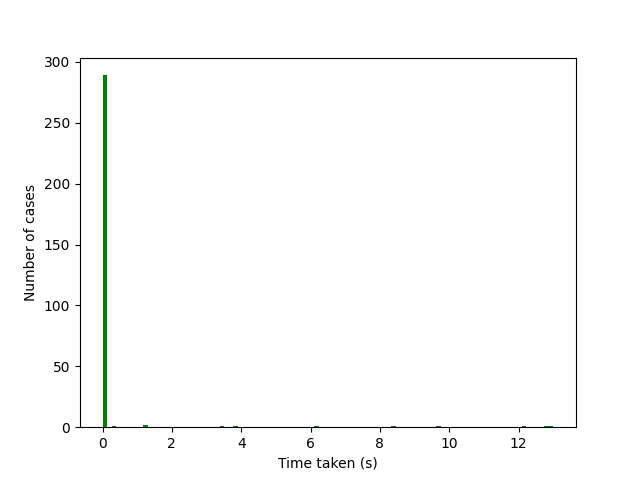

# COMP10001 Project 1: AI-player for Matching Games

## 1. Background
All background info is derived from UniMelb Comp10001 course

Our game consists of a number of coloured pieces on a two-dimensional board. Each piece can be represented as a string containing a single upper-case character between 'A' and 'Y'. The character 'Z' is used to indicate a blank position on the board. The board can be represented in Python by a list of lists. 

```
board = [['B', 'G', 'B', 'Y'], 
        ['G', 'B', 'Y', 'Y'], 
        ['G', 'G', 'Y', 'Z'],
        ['B', 'Z', 'Z', 'Z']]
```

Note that board[0][0] therefore corresponds to the position in the top-left corner of the board.

### Move:

A move is made by selecting a piece and specifying a direction in which it should be moved (up, down, left or right).

The piece can be selected by specifying its position (row, column) on the board. 

To specify the direction we use a single lower case character as follows:

- 'u': Up
- 'd': Down
- 'l': Left
- 'r': Right

### Eliminating pieces:

Four pieces of the same colour may be eliminated from the board by moving them into a 2 x 2 square. 

This leaves a 2 x 2 gap represented by four Z characters which is filled in the following manner:

1. All pieces immediately below the gap (i.e. in the same column with a higher row index) are moved up to fill any gaps.

2. All pieces immediately to the right of the gap (i.e. in the same row with a higher column index) are moved left to fill any gaps.

3. In the event of a tie (i.e. a single move causes more than one 2 x 2 square to be formed), the square beginning at the lowest row number is eliminated. If both squares begin at the same row number, the square with the lowest column number is eliminated. Only one square may be eliminated before its gaps are filled.

### Winning:

The player wins after eliminating all pieces from the table.

## 2. Implementations

Implemented in a modular approach for the assignments

Tasks: Create the AI-player finishing games in fastest amount of time (must be under 1-2s per board).

Key points:

1. AI-player = a path searching problems to find a sequence of moves to make the table empty

2. 3 possible approaches: BFS, DFS and Heuristic Search. All 3 have the same worst case scenarios when the board is impossible to solve. However, Heuristic Search generally gives better average running time, so is implemented.

3. The Heuristic used for the implementation to prioritize the sequence of moves that:
- Create more blank spaces
- The average Euclidian distance between same pieces are minimized (closer = easier to form square for elimination)

A score is calculated based on the Heuristic for ranking all partial sequence of moves. Details in `ai_player` function

Note: The Heuristic used tends to favour DFS, as more moves generally creating more blank spaces. Thus, the sequence of moves are not the shortest available path, but the quickest that could be found.

## 3. Results:

Implementations passed for the COMP10001 bonus marks.

Testing code is included. Major cases used for assignment were 4x4, but the function behaves normally on larger matrix (might be a bit slower). 

Generated test cases for 4x4 stored inside `test_cases_4x4.json`.

Note that in the worst case (no solutions), all possible sequence of moves are checked, leading to 
runtime raising around +10s, so 300 testing cases are used for rapid test.

Results for random sample of 300 4x4 board (All time in second):

```
Min time: 0.0
Max time: 13.007856369018555
Average time: 0.7412771248817444
```

Distributions (No dependency is needed, but matplotlib is used for plotting distribution):


